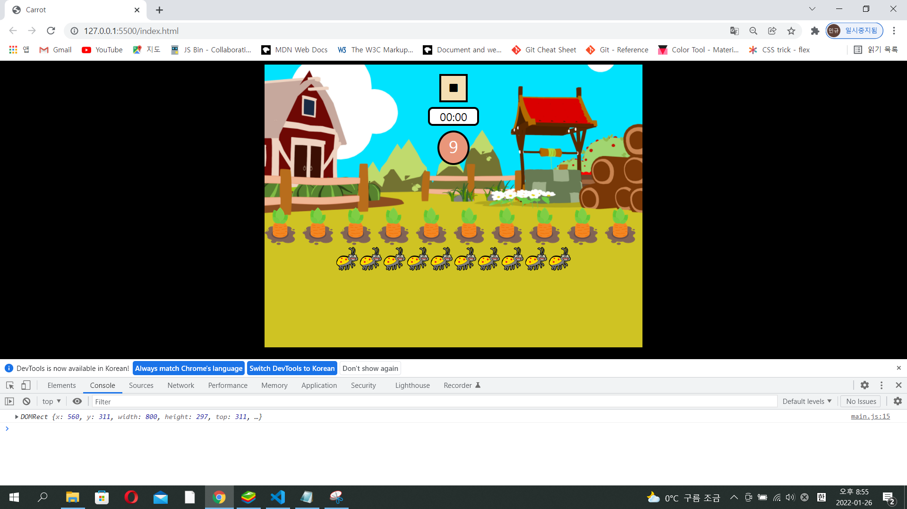

### 1. Project name: Creating application of carrot-game

### 2. Period : 4 day

### 3. Concept of game

- Please consider architecture of application in advance, at least on concept stage.

- The game should be played with timer that could discount 10s when clicking start symbol button. The start symbol button should be simultaneously changed to pause symbol button. It would be better to put tags named `button` and `span`s in section named `header`. `div` is also good. The reason why use `section` is that I want to divide sections definitely no matter who looks at it.

- Images of carrots and bugs should be positioned randomly on the section named field whenever clicking not only start button but also pause button. The position of images could be accumulated at the same place together.

- Image of carrots and bugs should be deleted when clicking the image of carrot and bug. In case of finished to click images of carrots and the image of carrot is empty on there before timeout, winner pop up message should be operated with icon of replay. In contrast, in case of not only timeout but also clicking bug image, loser pop up message should be operated with icon of replay.

### 4. Basic carrot game

- Application is created focusing on only operation regardless of optimizing.

#### 4-1. HTML file

- Tag named `body` is divided into two sections named `game` and `pop-up`. Some of tags is grouping and would be built correctly on parent tag according structure of HTML codes.

- In case you want to hide some of divs usually and to express those at the time you want, use option of CSS class selector like `.pop-up--hide{}` on CSS file and class name is needed to be changed from `pop-up` to `pop-up pop-up--hide`. In case you want to express text on window tab, it would be better to use tag named `span`, rather than `div` because `div` needs innertext or innerHTML to express the text. I think it is waste and it is not optimized to use memory.

- `<body>`
  `<section class="game">`
  `<section class="game__header">`
  `<button class="game__start">`
  `<i class="fas fa-play"></i>`
  `</button>`
  `0:0`
  `10`
  `</section>`
  `<section class="game__field"></section>`
  `</section>`
  `<section class="pop-up pop-up--hide">`
  `<button class="pop-up__refresh">`
  `<i class="fas fa-redo"></i>`
  `</button>`
  `hello`
  `</section>`
  `</body>`

- In case of all codes, Please refer file named `basic-application/basic.html`.

#### 4-2. CSS file

- In case you want to upload image as background on window tab, use CSS property named `background`. `center/cover` is of `url(./img/background.png)` is the command that image would be positioned to center and image size is adjusted to configured size of tag. In case you want to creat circle symbol, use `border-radious: 50%`. Syntax of CSS property named `border` is `border width, border style, border color` like `border: 4px solid black`. It is enough whether or not semicolon is. use `width: 100%` and `height: 100%` if you want to use layout of the section.

- In case of pop-up, CSS property is `background color: #00000090`. `#00000090` means black with opacity of 90%. In case you want only background to apply to opacity without others such as button, span, it would be efficient to use `#00000090`. In case you want to move layout of certain section, use `transform: translateX() or translateY()` such as `transform: translateY(-150%);`.

- `.game` {
  `display: flex;`
  `flex-direction: column;`
  `background: url(./img/background.png) center/cover;`
  `width: 800px;`
  `height: 600px;`
  `margin: auto;`
  `border-radius: 20px;`
  }
  `.game__score` {
  `text-align: center;`
  `width: 60px;`
  `height: 60px;`
  `font-size: 43px;`
  `background-color: darksalmon;`
  `color: white;`
  `border: 4px solid black;`
  `border-radius: 50%;`
  `margin-top: 15px;`
  }
  `.game__field` {
  `position: relative;`
  `width: 100%;`
  `height: 100%;`
  `margin-top: 70px;`
  }
  `.pop-up` {
  `display: block;`
  `width: 300px;`
  `height: 120px;`
  `background-color: #00000090;`
  `color: white;`
  `text-align: center;`
  `padding: 20px;`
  `margin: auto;`
  `border-radius: 20px;`
  `transform: translateY(-150%);`

- In case of all codes, Please refer file named `basic-application/style.css`.

#### 4-3. Javascript file

- The reason why I use `'use strict'` is that javascript language is very flexible, so you can assign value of variable even though the variable is not defined. `'use strict'` helps assign value of variable after you define variable. Type error would be displayed on console if you do not define variable when use `'use strict'`.

- In case you want to use images on HTML structure with undefined state not yet, use `createElement('img')` and `setAttribute()` on function. Tags and their attributes should be defined on the lowest function such as `for loop` to hide undefined value and use as local declaration. In addtion, function could have more than two arguments.

- In case assigned reference like `item.style.position` should be refered and the value is `'absolute'`, datas of `field.appendchild(item);` should be positioned on default coordinates like direction of northwest. In case of `appendChild`, `field` of `field.appendchild(item)` is parent node of `item`. The parent node has default value of position named `static` if not any other configured position. So, the parent node should be changed to `relative` to position icons on the area of `field`. Please consider image size when declaring variables related with coordinate. It is possible for image to be outside the area of `field` if not considered.

- In case you type `document.querySelector('.className')`, do not forget `.`of`(.className)`. Global variable is useful to use value as counter, size, and so on. You can only change value of global variable when this value used on many kind of functions.

- Toggle switch is very useful to play and restore application when clicking button. If loop is also very useful. In addition, do not hesitate to use a variety of functions to get correct outputs and operate normally. The most important thing is to operate this application normally. And then, refactorying could be possible to optimize memory. Please be careful regarding duplicated function on there when use many kinds of functions. In case you want to initialize some of area, use `element.innerHTML = template literal * 2`.

-`'use strict';`
`const field` = document.querySelector(`'.game__field'`);
`const fieldRect` = `field.getBoundingClientRect();`
`const gameBtn` = document.querySelector(`'.game__button'`);
`const Carrot_Size` = 80;
`const Carrot_Count` = 10;
`const Bug_Count` = 10;
`let started = false;`
`gameBtn.addEventListener`('click', ()=> {
`if (started)` {
`stopGame();`
} `else` {
`startGame();`
}
`started = !started;`
})
`function stopGame()` {
` field.innerHTML= ``; `
`showStartBtn();`
`hideTimerandScore();`
}
`function startGame()` {
`showStopBtn();`
`showTimerAndScore();`
`initGame();`
}
`function initGame()` {
`addItem('carrot', Carrot_Count, 'img/carrot.png');`
`addItem('bug', Bug_Count, 'img/bug.png');`
}
`function addItem(className, count, imgPath)` {
const x1 = 0
const y1 = 0;
`const x2 = fieldRect.width - Carrot_Size;`
`const y2 = fieldRect.height - Carrot_Size;`
`for(let i=0; i < count; i++)` {
`const item = document.createElement('img');`
`item.setAttribute('class', className);`
`item.setAttribute('src', imgPath);`
`item.style.position = 'absolute';`
`const x = randomNumber(x1, x2);`
`const y = randomNumber(y1, y2);`
item.style.left = `${x}px`;
item.style.top = `${y}px`;
`field.appendChild(item);`
}
}
`function randomNumber(min, max)` {
`return Math.random() * (max - min) + min;`
}

- In case of all codes, Please refer file named `basic-application/main.js`.

#### 4-4 Middle level output with random function

- 

#### 4-5. Timer

- Global variables should be defined to make value easier to be changed efficiently, such as `GAME_DURATION_SEC`, `timer`. In addtion, function local variable could use the global variables, such as `let RemaningTimeSec = GAME_DURATION_SEC;`. The one of reason why developer use timer as global variable is to stop timer easily when we needs. `setInterval()` and `clearInterval()` should be used to creat timer not only could keep running a task forever until end of configured time but also could stop interval when end of configured time within if loop. In case you want to exit the function when configured time immediately, use return within if loop. The function maybe operate one time after the time you want to stop if not use return within if loop. `Math.floor()` returns the largest integer value ignoring 0.xxx. `updateTimeText` function is callback function and use parameter named `time` as `RemainingTimeSec`. Call `updateTimeText(RemainingTimeSec)` outside `setInterval()` to display timer on gameTimer area. `--` of `updateTimeText(--RemainingTimeSec)` means minus(-) should be applied to timer. Call `updateTimeText(--RemainingTimeSec)` inside `setInterval()` and under if loop to discount timer. The timer should be finished if timer should be <= 0 by `clearInterval()`. However, The timer can not be finished abnormally and maybe to be continue to count if `updateTimeText(--RemainingTimeSec)` is upper if loop. So, The position of `updaterTimerText(--RemainingTimeSec)` is very important.

- `const gameTimer` = `document.querySelector('.game__timer');`
  `const GAME_DURATION_SEC` = 10;
  `let timer` = undefined;
  `function startGame()` {
  `startGameTimer();`
  }
  `function startGameTimer`() {
  `let RemainingTimeSec` = `GAME_DURATION_SEC;`
  `updateTimeText`(RemainingTimeSec);
  `timer` = `setInterval`(() => {
  `if(RemainingTimeSec <= 0)` {
  `clearInterval();`
  `return;`
  }
  `updateTimeText`(`--`RemainingTimeSec);
  }, `1000`);
  }
  `function updateTimeText`(`time`) {
  `const Minutes` = `Math.floor`(`time` / 60);
  `const Seconds` = `time` % 60;
  `gameTimer.innerText` = `${Minute} : ${Sec}`;
  }

- In case of all codes, Please refer file named `basic-application/main.js`.

### 5. Resolution of failures

#### 5-1.

- symptom: icons of not only carrot but also bug were positioned in rows. I did not use `item.style.position: 'absolute';`. In case of using `field.style.position: 'relative';`, icons would be positioned in rows even though I apply random function to coordinates because parent node of `field` named ` game__header` use `display: flex;`. Field element is also affected by `display: flex`.

- 

- countermeasure: use `item.style.position: 'absolute';` to position item dependently itself without influence of parent element.

#### 5-2.

- symptom: type error message was displayed on console tab. However, icons were placed randomly and correctly on field element. It means normal operation but displayed type error message named `Cannot read properties of null (reading 'classList') at showStopBtn.` The meaning of error message is that classList of showStopBtn is not found.

- We should check operation sequences regarding classList according to clicking event.

- First, clicking start Btn.

  1. click 'play' button(started = false)
  2. call startGame()
  3. call initGame()
  4. call showStopBtn()
  5. execute const icon = document.querySelector('.fa-play') -> current class = 'fa-play'
  6. execute icon.classList.add('fa-stop') -> current class = 'fa-play' and 'fa-stop'
  7. execute icon.classList.remove('fa-play') -> current class = 'fa-stop'
  8. Btn image changed from 'play' to 'stop'

- second, clicking stop Btn.

  1. click 'stop' button(started = true)
  2. call stopGame()
  3. call initGame()
  4. call showStartBtn()
  5. execute const icon = document.querySelector('.fa-stop') -> current class = 'fa-stop'
  6. execute icon.classList.add('fa-play') -> current class = 'fa-stop' and 'fa-play'
  7. execute icon.classList.remove('fa-stop') -> current class = 'fa-play'
  8. Btn image changed from 'stop' to 'play'

- There are two type of this error message. First, functions related with the fucntion named showStopBtn are not defined correctly. In my case, toggle is not defined at addEventListener and not only `if(!started) {return;}` but also `const icon = document.querySelector('fa-stop');` is added within `showStartBtn()`. Second, duplicated function `stopGame()` is declared once again on main loop. The same error message cold occurred even though root causes did not come from at `showStopBtn()`.

- 

- countermeasure:

  1. Toggle Btn is applied to addEventListener, such as `gameBtn.addEventListner('click', ()=> {if(started) {stopGame();} else {startGame();} started=!started`. In addition, `if(!started){return;}` and `const icon = document.querySelector('fa-stop');` is added within `showStartBtn()`.
  2. Check duplicated same function such as `stopGame()`.

#### 5-3.

- symptom: type error message was displayed on console tab. In addition, icons were not placed randomly when clicking stop button. It displayed type error message named `Failed to execute 'addEventListener' on 'EventTarget':2 arguments required, but only 1 present.` `EventListener` needs 2 arguments such as type and function. For example, `type` use as `'click'` and `function` use as `callback`.
  I mis-use `const icon = document.addEventListener('.fa-stop');` at `showStartBtn()`.

- 

- I checked cause of type error on source tab.

- 

- countermeasure: `const icon = document.addEventListener('.fa-stop');` should be changed to `const icon = document.querySelector('.fa-stop');`
