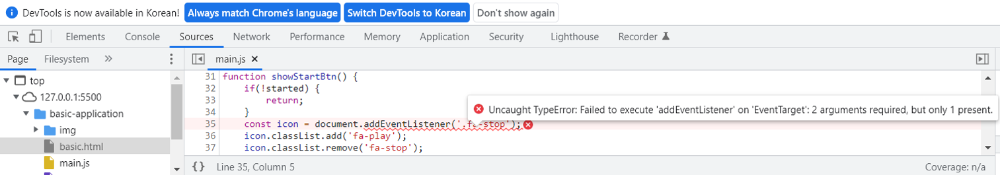
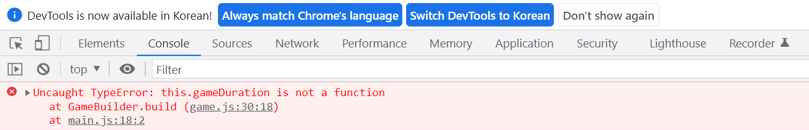

### 1. Project name: Creating application of carrot-game

### 2. Period : 1 week 5 days

### 3. Concept of game

- Please consider architecture of application in advance, at least on concept stage.

- The game should be played with timer that could discount 10s when clicking start symbol button. The start symbol button s8 xz bn 1
  ㅍ hould be simultaneously changed to pause symbol button. It would be better to put tags named `button` and `span`s in section named `header`. `div` is also good. The reason why use `section` is that I want to divide sections definitely no matter who looks at it.

- Images of carrots and bugs should be positioned randomly on the section named field whenever clicking not only start button but also pause button. The position of images could be accumulated at the same place together.

- Image of carrots and bugs should be deleted when clicking the image of carrot and bug. In case of finished to click images of carrots and the image of carrot is empty on there before timeout, winner pop up message should be operated with icon of replay. In contrast, in case of not only timeout but also clicking bug image, loser pop up message should be operated with icon of replay.

### 4. Basic carrot-game

- Application is created focusing on only operation regardless of optimizing.

#### 4-1. HTML file

- Tag named `body` is divided into two sections named `game` and `pop-up`. Some of tags is grouping and would be built correctly on parent tag according structure of HTML codes.

- In case you want to hide some of divs usually and to express those at the time you want, use option of CSS class selector like `.pop-up--hide{}` on CSS file and class name is needed to be changed from `pop-up` to `pop-up pop-up--hide`. In case you want to express text on window tab, it would be better to use tag named `span`, rather than `div` because `div` needs innertext or innerHTML to express the text. I think it is waste and it is not optimized to use memory.

- `<body>`
  `<section class="game">`
  `<section class="game__header">`
  `<button class="game__start">`
  `<i class="fas fa-play"></i>`
  `</button>`
  `0:0`
  `10`
  `</section>`
  `<section class="game__field"></section>`
  `</section>`
  `<section class="pop-up pop-up--hide">`
  `
`
  `<button class="pop-up__refresh">`
  `<i class="fas fa-redo"></i>`
  `</button>`
  `<button class="pop-up__exit">`
  `<i class="fas fa-times"></i>`
  `</button>`
  `
`
  `hello`
  `</section>`
  `</body>`

- In case of all codes, Please refer file named `basic-application/basic.html`.

#### 4-2. CSS file

- In case you want to upload image as background on window tab, use CSS property named `background`. `center/cover` is of `url(./img/background.png)` is the command that image would be positioned to center and image size is adjusted to configured size of tag. In case you want to creat circle symbol, use `border-radious: 50%`. Syntax of CSS property named `border` is `border width, border style, border color` like `border: 4px solid black`. It is enough whether or not semicolon is. use `width: 100%` and `height: 100%` if you want to use layout of the section.

- In case of pop-up, CSS property is `background color: #00000090`. `#00000090` means black with opacity of 90%. In case you want only background to apply to opacity without others such as button, span, it would be efficient to use `#00000090`. In case you want to move layout of certain section, use `transform: translateX() or translateY()` such as `transform: translateY(-150%);`.

- `body` {
  `text-align: center;`
  `background-color: black;`
  }
  `.game` {
  `display: flex;`
  `flex-direction: column;`
  `background: url(./img/background.png) center/cover;`
  `width: 800px;`
  `height: 600px;`
  `margin: auto;`
  `border-radius: 20px;`
  }
  `.game__score` {
  `text-align: center;`
  `width: 60px;`
  `height: 60px;`
  `font-size: 43px;`
  `background-color: darksalmon;`
  `color: white;`
  `border: 4px solid black;`
  `border-radius: 50%;`
  `margin-top: 15px;`
  }
  `.game__field` {
  `position: relative;`
  `width: 100%;`
  `height: 100%;`
  `margin-top: 70px;`
  }
  `.pop-up` {
  `display: block;`
  `width: 300px;`
  `height: 120px;`
  `background-color: #00000090;`
  `color: white;`
  `text-align: center;`
  `padding: 20px;`
  `margin: auto;`
  `border-radius: 20px;`
  `transform: translateY(-150%);`

- In case of all codes, Please refer file named `basic-application/style.css`.

#### 4-3. Javascript file

- Please check javascript file matched HTML file before using live sever.

- The reason why I use `'use strict'` is that javascript language is very flexible, so you can assign value of variable even though the variable is not defined. `'use strict'` helps assign value of variable after you define variable. Type error would be displayed on console if you do not define variable when use `'use strict'`.

- In case you want to use images on HTML structure with undefined state not yet, use `createElement('img')` and `setAttribute()` on function. Tags and their attributes should be defined on the lowest function such as `for loop` to hide undefined value and use as local declaration. In addtion, function could have more than two arguments.

- In case assigned reference like `item.style.position` should be refered and the value is `'absolute'`, datas of `field.appendchild(item);` should be positioned on default coordinates like direction of northwest. In case of `appendChild`, `field` of `field.appendchild(item)` is parent node of `item`. The parent node has default value of position named `static` if not any other configured position. So, the parent node should be changed to `relative` to position icons on the area of `field`. Please consider image size when declaring variables related with coordinate. It is possible for image to be outside the area of `field` if not considered.

- In case you type `document.querySelector('.className')`, do not forget `.`of`(.className)`. Global variable is useful to use value as counter, size, and so on. You can only change value of global variable when this value used on many kind of functions. In addition, use `document.querySelecotr('.fas')` instead of `('.fa-play') or ('fa.stop')` to prevent type error `'Cannot read properties of null (reading 'classList')` when using function named `showStopBtn()`. It is event delegation. The concept of event delegation is to use parent node named `'fas'` which could refer the reference of `'fa-play'` and `' fa-stop'` on javascript.

- Toggle switch is very useful to play and restore application when clicking button. If loop is also very useful. In addition, do not hesitate to use a variety of functions to get correct outputs and operate normally. The most important thing is to operate this application normally. And then, refactorying could be possible to optimize memory. Please be careful regarding duplicated function on there when use many kinds of functions. In case you want to initialize some of area, use `element.innerHTML = template literal * 2`. In case of using more than 3 functions related with variable named `stared`, `started` should be defined within each of functions, rather than using `started = !started;`.

- -`'use strict';`
  `const field` = document.querySelector(`'.game__field'`);
  `const fieldRect` = `field.getBoundingClientRect();`
  `const gameBtn` = document.querySelector(`'.game__button'`);
  `const Popup` = document.querySelector(`'.pop-up'`);
  `const PopupText` = document.querySelector(`'.pop-up__message'`);
  `const PopupBtn` = document.querySelector(`'.pop-up__refresh'`);
  `const Carrot_Size` = 80;
  `const Carrot_Count` = 10;
  `const Bug_Count` = 10;
  `let started = false;`
  `gameBtn.addEventListener`('click', ()=> {
  `if (started)` {
  `stopGame();`
  } `else` {
  `startGame();`
  }
  })
  `PopupBtn.addEventListener`('click', ()=> {
  `replayGame();`
  })
  `function replayGame()` {
  `started = false;`
  `startGame();`
  `showGameBtn();`
  `hidePopupwithText();`
  }
  `function startGame()` {
  `started = true;`
  `showStopBtn();`
  `showTimerAndScore();`
  `initGame();`
  }
  `function stopGame()` {
  `started = false;`
  ` field.innerHTML= ``; `
  `showStartBtn();`
  `hideTimerandScore();`
  `showPopupwithText('Replay? or Exit?');`
  }
  `function showGameBtn()` {
  `gameBtn.style.visibility = 'visible';`
  }
  `function hideGameBtn()` {
  `gameBtn.style.visibility = 'hidden';`
  }
  `function showPopupwithText(text)` {
  `Popup.classList.remove('pop-up--hide');`
  `PopupText.innerText = text;`
  }
  `function hidePopupwithText()` {
  `Popup.classList.add('pop-up--hide');`
  }
  `function showStopBtn()` {
  `const icon` = document.querySelector(`'.fas'`);
  `if(started)`{
  `icon.classList.add('fa-stop');`
  `icon.classList.remove('fa-play');`  
   } `else` {
  `return;`
  }
  }
  `function showTimerAndScore()` {
  `if(started)`{
  `gameTimer.style.visibility = 'visible';`
  `gameScore.style.visibility = 'visible';`
  }
  }
  `function initGame()` {
  `addItem('carrot', Carrot_Count, 'img/carrot.png');`
  `addItem('bug', Bug_Count, 'img/bug.png');`
  }
  `function addItem(className, count, imgPath)` {
  const x1 = 0
  const y1 = 0;
  `const x2 = fieldRect.width - Carrot_Size;`
  `const y2 = fieldRect.height - Carrot_Size;`
  `for(let i=0; i < count; i++)` {
  `const item = document.createElement('img');`
  `item.setAttribute('class', className);`
  `item.setAttribute('src', imgPath);`
  `item.style.position = 'absolute';`
  `const x = randomNumber(x1, x2);`
  `const y = randomNumber(y1, y2);`
  item.style.left = `${x}px`;
  item.style.top = `${y}px`;
  `field.appendChild(item);`
  }
  }
  `function randomNumber(min, max)` {
  `return Math.random() * (max - min) + min;`
  }

- In case of all codes, Please refer file named `basic-application/main_middle_output.js`.

#### 4-4 Middle level output with random function

- 

#### 4-5. Timer

- Global variables should be defined to make value easier to be changed efficiently, such as `GAME_DURATION_SEC`, `timer`. In addtion, function local variable could use the global variables, such as `let RemaningTimeSec = GAME_DURATION_SEC;`. The one of reason why developer use timer as global variable is to stop timer easily when we needs. `setInterval()` and `clearInterval()` should be used to creat timer not only could keep running a task forever until end of configured time but also could stop interval when end of configured time within if loop. In case you want to exit the function when configured time immediately, use return within if loop. The function maybe operate one time after the time you want to stop if not use return within if loop. `Math.floor()` returns the largest integer value ignoring 0.xxx. `updateTimeText` function is callback function and use parameter named `time` as `RemainingTimeSec`. Call `updateTimeText(RemainingTimeSec)` outside `setInterval()` to display timer on gameTimer area. `--` of `updateTimeText(--RemainingTimeSec)` means minus(-) should be applied to timer. Call `updateTimeText(--RemainingTimeSec)` inside `setInterval()` and under if loop to discount timer. The timer should be finished if timer should be <= 0 by `clearInterval()`. In case of `clearInterval()`, I recommend use `clearInterval(timer)` because parameter should be needed when you use this within other function. However, The timer can not be finished abnormally and maybe to be continue to count if `updateTimeText(--RemainingTimeSec)` is upper if loop. So, The position of `updaterTimerText(--RemainingTimeSec)` is very important.

- In case of boolean type named `started`, precondition is `false` before executing `startGame()`. However, value of started should be changed from `false` to `true` within `startGame()` when executing `startGame()`. This is also concept of toggle. Please do not forget that boolean type value should be changed when between before and when executing `startGame()` for operating correctly. I think `stared = !started` within `gameBtn.addEventListener()` means to control precondition before and after executing function named `startGame()` or `stopGame()`. In case of using same boolean type variable among more than 3 functions, the value of variable should be defined within function itself, rather than using `started = !started`. It would be possible to get malfunction timer because the timer is accumulated without stoping timer when it needed. In addition, please consider to stop timer when carrot icons removed completely. So, use `finishGame(Carrot_Count === score);` within `if(RemainingTimeSec <= 0)`. `finishGame(Carrot_Count === score);` means to return true if carrot icon removed completely when timer is 0, or to return false else if carrot icon do not removed completely when timer is 0.

- `const gameTimer` = `document.querySelector('.game__timer');`
  `const PopupBtn = document.querySelector('.pop-up__refresh);`
  `const GAME_DURATION_SEC` = 10;
  `let timer` = undefined;
  `gameBtn.addEventListener`('click', ()=> {
  `if (started)` {
  `stopGame();`
  } `else` {
  `startGame();`
  }
  })
  `PopupBtn.addEventLisetner`('click', ()=> {
  `replayGame();`
  })
  `function replayGame()` {
  `started = false;`
  `startGame();`
  }
  `function stopGame()` {
  `started = false;`
  `stopGameTimer();`
  }
  `function startGame()` {
  `started = true;`
  `startGameTimer();`
  }
  `function stopGameTimer()` {
  `clearInterval(timer);`
  }
  `function startGameTimer`() {
  `let RemainingTimeSec` = `GAME_DURATION_SEC;`
  `updateTimeText`(RemainingTimeSec);
  `timer` = `setInterval`(() => {
  `if(RemainingTimeSec <= 0)` {
  `finishGame(Carrot_Count === score);`
  `clearInterval(timer);`
  `return;`
  }
  `updateTimeText`(`--`RemainingTimeSec);
  }, `1000`);
  }
  `function updateTimeText`(`time`) {
  `const Minutes` = `Math.floor`(`time` / 60);
  `const Seconds` = `time` % 60;
  `gameTimer.innerText` = `${Minute} : ${Sec}`;
  }

- In case of all codes, Please refer file named `basic-application/main2.js`.

#### 4-6. Remove icon and load pop-up message with event delegation

- To operate when clicking on only field area, use `field.addEventListener`. `field.addEventListener('click', ()=> onFieldClick(event));` is same as `field.addEventListener('click', onFieldClick);`. In case you want to use click event when clicking play button, use `if(!started){return;}`. In case of API named `target.matches()`, indicate whether or not target is matched to CSS selector. return value is true or false according to boolean type. So, `target.matches()` suits `if loop`. The `if loop` operates function with true value.

- The reason why `started = false;` is used within functions named between `replayGame()` and `finishGame()` is that `started value` should be `false` before executing `startGame()`. The reason why `finishGame()` needs is that game should be finished when not only clicking bug icon but also timer is 0. `finishGamed()` is also needed `stopGameTimer()` because timer should be stopped when `finishGame()`. The rule of `ReplayGame()` is to replay game when clicking pop-up button. In case of `ReplayGame()`, it makes difficult to combine functions because it is impossible to start and finish at the same time. So, `finishGame()` should be added. In case you want to creat text on pop-up message, use `showPopupwithText()` same as within `stopGame()`. Please reminder score should be initialized when clicking replay button. If you use `initScore()` within `finishGame()`, score should be updated when displaying pop-up message. So, use `initScore()` within `replayGame()`.

- `PopupBtn.addEventListener`('click', ()=> {
  `replayGame();`
  })
  `field.addEventListener`('click', `onFieldClick`);
  `function onFieldClick(event)` {
  `if(!started)` {
  `return;`
  }
  `const target = event.target;`
  `if(target.matches('.carrot'))` {
  `target.remove();`
  `score++;`
  `updateScore();`
  `if(Carrot_Count === score)` {
  `finishGame(true);`
  }
  } `else if(target.matches('.bug'))` {
  `finishGame(false);`
  }
  }
  `function replayGame()` {
  `started = false;`
  `initScore();`
  `updateScore();`
  }
  `function finishGame(win)` {
  `started = false;`
  `stopGameTimer();`
  `hideGameBtn();`
  `showPopupwithText(win? 'You Won!' : 'You Lost!');`
  }
  `function updateScore()` {
  `gameScore.innerText = Carrot_Count - score;`
  }
  `function initScore()` {
  `if (finishGame)` {
  `score = 0;`
  }
  }

- In case of all codes, Please refer file named `basic-application/main2.js`.

#### 4-7. Add sound

- 5 type sounds would be declared. In case of background sound when executing `startGame()`, use `bgSound`. In case of removed carrot icon completely on window tab and score is 0, use `winSound`. In case of clicking carrot icon, use `carrotSound`. In case of clicking bug icon, use `bugSound`. In case of clicking stop button, use `alertSound`.
- To add or remove sound according to each of events, references of audio should be defined on javascript at first, and then, use not only `playSound()` but also `pauseSound()` with callback function to play each of sounds. In case the background sound should be initialized per play, use `element.currentTime=0;` within `playSound()`. It would be possible for currentTime to be changed when you want to time with setted value.

- In case of conditional operator named `else{}` within `finishGame()`, `else{pauseSound(bgSound);}` includes `pauseSound(bgSound);` within `stopGameTimer()`. I recommend you to use `stopGameTimer(){pauseSound(bgSound);}` to help other developer understand my intent definitely. If you use `else{pauseSound(bgSound);}`, Please annotate for better understanding.

- `const carrotSound` = `new Audio('./sound/carrot_pull.mp3');`
  `const bugSound` = `new Audio('./sound/bug_pull.mp3');`
  `const bgSound` = `new Audio('./sound/bg.mp3');`
  `const winSound` = `new Audio('./sound/game_win.mp3');`
  `const alertSound` = `new Audio('./sound/alert.wav');`
  `function playSound(sound)` {
  `sound.play();`
  `sound.currentTime = 0;`
  }
  `function pauseSound(sound)` {
  `sound.pause();`
  }
  `function finishGame(win)` {
  `if(Carrot_Count === score)` {
  `playSound(winSound);`
  `pauseSound(bgSound);`
  } `else` {
  `playSound(bugSound);`
  `pauseSound(bgSound);`
  }
  }
  `function startGame()` {
  `playSound(bgSound);`
  }
  `function stopGame()` {
  `pauseSound(bgSound);`
  `playSound(alertSound);`
  }

- In case of all codes, Please refer file named `basic-application/main_addsound.js`.

#### 4-9. Add exitBtn

- In case we use `element.addEventListener('click', xxx);`, we can not use `element.addEventListener('dblclick', xxxx);`. The only one case of operating with double-clicking is condition before clicking button with `element.addEventLister('click', xxx);`. In addition, `return false;` should be needed to ignore one click when double-clicking. For example, `element.addEventListener('dblclick', ()=>{return false;});`. So, I use event as `'contextmenu'` instead of `'dblclick'`. `'contextmenu'` could be trigger by clicking the right mouse button.

- `hideTimerAndScore()` is added because timer and score should disappear when `exitGame();`. I use `if(!started){}` because `exitGame()` has `started = false;`. In case of `showTimerAndScore()`, I use `if(started){}` because `startGame()` has `started = true;`.

- `gameBtn.addEventListener('contextmenu'`, ()=> {
  `exitGame();`
  })
  `function exitGame()` {
  `started = false;`
  ` field.innerHTML = ``; `
  `hideTimerAndScore();`
  `stopGameTimer();`
  `showStopBtn();`
  `pauseSound(bgSound);`
  }
  `function hideTimerAndScore()` {
  `if(!started)`{
  `gameTimer.style.visibility = 'hidden';`
  `gameScore.style.visibility = 'hidden';`
  }
  }

- This is output using `addEventListener('contextmenu', xx)`.
  

- In case of all codes, Please refer file named `basic-application/main_addexitBtn1.js`.

- I changed from clicking the right mouse button to click added exit button.

- In case of HTML file, div tag with class named `button__row` and button tag with class named `pop-up__exit` as below.

- `<section class="pop-up pop-up--hide">`
  `
`
  `<button class="pop-up__refresh">`
  `<i class="fas fa-redo"></i>`
  `</button>`
  `<button class="pop-up__exit">`
  `<i class="fas fa-times"></i>`
  `</button>`
  `
`
  `hello`
  `</section>`

- In case of CSS file, class CSS selector named `.button__row` should be defined `space-evenly` to keep same empty space between the buttons. `.pop-up__exit` is decorated as same as `.pop-up__refresh`.

- `.button__row` {
  `display: flex;`
  `justify-content: space-evenly;`
  }
  `.pop-up__exit` {
  `width: 60px;`
  `height: 60px;`
  `background-color: wheat;`
  `font-size: 30px;`
  `border: 2px solid black;`
  `border-radius: 50%;`
  }

- In case of javascript file, use variable named exitBtn to refer the reference of exitBtn button, and then, `exitGame()` has most of functions as same as `replayGame()` or `finishGame()`. There are only two of different things. The one is to use `showStopBtn()`. `showStopBtn()` could change button symbol from `stop` to `play` if `stared = false;`. The other is to use ` field.innerHTML = ``; ` because we need initial screen without `startGame()`.

- `const exitBtn` = document.querySelector(`'.pop-up__exit'`);
  `exitBtn.addEventListener('click'`, ()=> {
  `exitGame();`
  })
  `function exitGame`() {
  `started = false;`
  ` field.innerHTML = ``; `
  `initScore();`
  `updateScore();`
  `hideTimerAndScore();`
  `stopGameTimer();`
  `showStopBtn();`
  `showGameBtn();`
  `pauseSound(bgSound);`
  `hidePopupwithText();`
  }

- In case of all codes, Please refer file named `basic-application/main_addexitBtn2.js`.

#### 4-10. Checking user covenience

- User convenience is important because customer of application is user. In case of user covenience, please check with user preference. The user covenience and user preference have synergy. Checking and improving user convenience is to improve function quality and application value. Checking user preference is to catch customer needs. So, they have complementary relationship and should be considered together.

- User could mis-click the timer block or score block. Shading block could be shown to user unnecessarily when mis-clicking the timer block or score block. To remove unnecessarily displayed blue shading block, use `user-select: none;`. In addition, use `transform` and `transition` to increase size of scale. The goal is to make it easier for user to know whether or not mouse cursor points icons.

- 
  

- In case of CSS file,
  `.game__timer` {
  `user-select: none;`
  }
  `.game__score` {
  `user-select: none;`
  }
  `.carrot`,
  `.bug` {
  `transition: transform 100ms ease-in;`
  }
  `.carrot:hover`,
  `.bug:hover` {
  `transform: scale(1.1);`
  }

#### 4-11. Output

- 

### 5. Refactoring carrot-game

- The bad thing is not easy to manage and verify functions when changed point occur if codes are typed on just only one file even though application could operate normally. So, I think it would be better only one file is distrubuted to several files according to grouping functions. In case of distributed files as refactoring, I think there would be benefits from template. The template could be conveniently used for objects when you needed. So, this is the reason why we use template of class as refactoring. There are two examples. First, in case two type of cars need some of same functions, we could use refactoring file as source of two project cars regarding the same functions. Second, in case you want to manage grouped functions on distributed files like component, use refactoring with template of class. In addition, in case of simple appication, using refactoring with template of class is more difficult than function in function. However, in case of complicated application, please remind that refactoring is easier to manage functions because template of class could make objects on any other files easily when you needed. The keyword named `export default` should be typed on refactoring file, and then, the keyword named `import from` should be typed on main javascript file. For example, if `export default class Popup {}` defined from refactoring file, `import PopUp from './popup.js'` should be defined on main javascript file.

- Start of refactoring is to classify roles of application functions. In case of popup.js, the role is to show popup and to hide popup and to has callback function to call functions when clicking buttons of popup. In case of field.js, the role is to add icons of carrots and bugs and to remove icon of carrots and to has callback functions to call functions when `start()`, `finish()` and `stop()`.

#### 5-1. Popup class

- Variables within `constructor()` should be defined with `this` insted of keyword named `const`. Please think `this` is one of class syntax for easy understanding. In case of `addEventListener`, it could be included within `constructor()`. `this.onClick && this.onClick()` is same as `if(this.onClick){this.onClick();}`. `setClickListener(onClick)` means that this.onClick is defined callback function. So, not only `this.onClick && this.onClick()` but also `setClickListener(onClick)` are needed to use callback function within class. In case of functions related to the class, the functions you want could be defined as method of class. Each of element within function needs `this` because the function is one of class methods. In case of function named `showWithText(text)`, is renamed from `showPopupwithText(text)`. `Popup` of `showPopupwithText(text)` do not need to because the function is within class named `Popup`. This is duplicated. Please use `showWithText(text)` within function you want on `game.js` to display popup tab on application. In case of function named `hide()`, it could be included within `constructor()` and it should be defined as `this.hide()` to refer the reference instead of `hide()`. `Uncaught ReferenceError` maybe occur if you use `hide()`. The reason why I use `this.PopupBtn.addEventListener('click', ()=> {this.onClick && this.onClick(); this.hide();});` rather than `this.PopupBtn.addEventListener('click', onClick());` is that `this.hide()` should be operated when clicking `PopupBtn`.

- In popup.js,
  `export default class PopUp` {
  `constructor()` {
  `this.Popup` = document.querySelector(`'.pop-up'`);
  `this.PopupText` = document.querySelector(`'.pop-up__message'`);
  `this.PopupBtn` = document.querySelector(`'.pop-up__refresh'`);
  `this.PopupBtn.addEventListener('click'`, () => {
  `this.onClick && this.onClick();`
  `this.hide();`
  });
  }
  `setClickListener(buttonName, onClick)` {
  `this.onClick = onClick;`
  `this[buttonName].addEventListener('click', onClick);`
  }
  `showWithText(text)` {
  `this.Popup.classList.remove('pop-up--hide');`
  `this.PopupText.innerText = text;`
  }
  `hide()` {
  `this.Popup.classList.add('pop-up--hide');`
  }
  }

- In game.js,
  `this.gameFinishpopUp = new PopUp();`
  `this.gameFinishpopUp.setClickListener('PopupBtn', this.replay);`
  `this.gameFinishpopUp.setClickListener('exitBtn', this.exit);`
  `exit = () =>` {
  `this.gameFinishpopUp.hide();`
  }
  `replay = () =>` {
  `this.gameFinishpopUp.hide();`
  }
  `finish(win)` {
  `this.onGamestop && this.onGamestop(win? 'win' : 'lose');`
  }
  `stop()` {
  `this.onGamestop && this.onGamestop('cancel');`
  }

- In main.js,
  `game.setGameStopListener((reason) => {`
  `let message;`
  `switch (reason)` {
  `case 'cancel':`
  `message = 'Replay? or Exit?';`
  `break;`
  `case 'win':`
  `message = 'You Won!';`
  `break;`
  `case 'lose':`
  `message = 'You Lost!';`
  `break;`
  `default:`
  `throw new Error('not valid reason');`
  }
  `gameFinishpopUp.showWithText(message);`
  })

- In case of all codes, Please refer file named `refactoring/game.js`, `refactoring/main.js` and `refecotring/popup.js`.

#### 5-2. Field class

- Fields parameters of `constructor()` are defined as `carrotCount`, `bugCount`, `carrotSize` to apply arguments of object when `this.gameField = new Field(this.carrotCount, this.bugCount, this.carrotSize);` on `game.js`. In case of methods, some of functions are moved from `game.js` to within class on `field.js` considering field roles of application. `onFieldClick()` from `game.js` is distributed to not only `onClick()` on `field.js` but also `onFieldClick()` on `game.js` according to the roles of application. `this.onItemClick && this.onItemClick('carrot')` is used with callback function to operate `onClick()` and `onFieldClick()` at the same time. `'carrot'` and `'bug'` is used as parameter of callback function to set up operation condition. For example, functions should be operated related to `carrot` when clicking icon of carrot. In addition, functions named `randomNumber()` and `playSound()` are used as static function because these functions would use on only `field.js`. In case of only using the function on this javascript file, you can use static function, rather than method of class. In case of `if(item === 'carrot')` and `if(item === 'bug')` of `onFieldClick()` on game.js, icons of carrot and bug are `item` with `event.target` on `field.js` and this binding should be used if `item` and `event.target` are refered on `game.js` without undefined value. In case of javascript, please remind template of class can not be transfered if the function is within other function. `this` binding should be used to transfer template of class to the function within other function. In case you do not use `this.` of `this.fieldRect.width` or `this.fieldRect.height`, icons of carrots and bugs do not displayed on field area. So, In case icons do not displayed on field area, please check values related to coordinates.

- Add `import * as sound from './sound.js';` to refer the reference of sound on sound.js.

- In case of field.js,
  `'use strict';`
  `import * as sound from './sound.js';`
  `const carrotSound = new Audio('./sound/carrot_pull.mp3');`
  `export default class Field` {
  `constructor(Carrot_Count, Bug_Count, Carrot_Size)` {
  `this.Carrot_Count = Carrot_Count;`
  `this.Bug_Count = Bug_Count;`
  `this.Carrot_Size = Carrot_Size;`
  `this.field = document.querySelector('.game__field');`
  `this.fieldRect = this.field.getBoundingClientRect();`
  `this.field.addEventListener('click', (event) => this.onClick(event));`
  }
  `init()` {
  `this.field.innerHTML` = `template literal * 2`.
  `this.addItem('carrot', this.Carrot_Count, 'img/carrot.png');`
  `this.addItem('bug', this.Bug_Count, 'img/bug.png');`
  }
  `exit()` {
  ` this.field.innerHTML = ``; `
  }
  `addItem(className, count, imgPath)` {
  `const x1 = 0;`
  `const y1 = 0;`
  `const x2 = this.fieldRect.width - this.Carrot_Size;`
  `const y2 = this.fieldRect.height - this.Carrot_Size;`
  `for(let i=0; i < count; i++)` {
  `const item = document.createElement('img');`
  `item.setAttribute('class', className);`
  `item.setAttribute('src', imgPath);`
  `item.style.position = 'absolute';`
  `const x = randomNumber(x1, x2);`
  `const y = randomNumber(y1, y2);`
  `item.style.left = `${x}px`;`
  `item.style.top = `${y}px`;`
  `this.field.appendChild(item);`
  }
  }
  `setClickListener(onItemClick)` {
  `this.onItemClick = onItemClick;`
  }
  `onClick(event)` {
  `const target = event.target;`
  `if(target.matches('.carrot'))` {
  `target.remove();`
  `sound.playCarrot();`
  `this.onItemClick && this.onItemClick('carrot');`
  } `else if(target.matches('.bug'))` {
  `this.onItemClick && this.onItemClick('bug');`
  }
  }
  }
  `function randomNumber(min, max)` {
  `return Math.random() \* (max - min) + min;`
  }

- In case of game.js,
  `this.gameField = new Field(Carrot_Count, Bug_Count, Carrot_Size);`
  `this.gameField.setClickListener(this.onFieldClick);`
  `onFieldClick()` {
  `if(!this.started)` {
  `return;`
  }
  `if(item === 'carrot')` {
  `this.score++;`
  `this.updateScore();`
  `if(this.carrotCount === this.score)` {
  `this.finish(true);`
  }
  } `else if(item === 'bug')` {
  `this.finish(false);`
  }
  }
  `exit()` {
  `this.gameField.exit();`
  }

- In case of all codes, Please refer file named `refactoring/main.js` and `refecotring/field.js`.

#### 5-3. Sound class

- `import * as sound from './sound.js';` means to insert sound into the current scope, containing all the exports from the module in the file from `'./sound.js'`. so you can refer the reference of all export functions on any other javascript file. You do not need to define variable and node to use sound. For example, just use `sound.palyCarrot();` within any functions on any javascript file.

- In case of sound.js,
  `const carrotSound = new Audio('./sound/carrot_pull.mp3');`
  `const bugSound = new Audio('./sound/bug_pull.mp3');`
  `const bgSound = new Audio('./sound/bg.mp3');`
  `const winSound = new Audio('./sound/game_win.mp3');`
  `const alertSound = new Audio('./sound/alert.wav');`
  `export function playCarrot()` {
  `playSound(carrotSound);`
  }
  `export function playBug()` {
  `playSound(bugSound);`
  }
  `export function playAlert()` {
  `playSound(alertSound);`
  }
  `export function playWin()` {
  `playSound(winSound);`
  }
  `export function playBackground()` {
  `playSound(bgSound);`
  }
  `export function stopBackground()` {
  `pauseSound(bgSound);`
  }
  `function playSound(sound)` {
  `sound.play();`
  `sound.currentTime = 0;`
  }
  `function pauseSound(sound)` {
  `sound.pause();`
  }

- In case of main.js,
  `import * as sound from './sound.js';`
  `function onFieldClick(item)` {
  `if(item === 'carrot')` {
  `sound.playCarrot();`
  }
  }
  `function exitGame`() {
  `sound.stopBackground();`
  }
  `function finishGame(win)` {
  `if(Carrot_Count === score)` {
  `sound.playWin();`
  `sound.stopBackground();`
  } `else` {
  `sound.playBug();`
  `sound.stopBackground();`
  }
  }
  `function startGame`() {
  `sound.playBackground();`
  }
  `function stopGame()` {
  `sound.stopBackground();`
  `sound.playAlert();`
  }

- In case of all codes, Please refer file named `refactoring/main.js`, `refactoring/field.js` and `refecotring/sound.js`.

#### 5-4. Game class

- 4 arguments of `constructor()` on `game.js` are needed to use 4 variables as paremeter of class on `main.js`. `gameField` is object with class `Field`. The role of `gameField` is to use functions from field.js to game.js. `gameFinishpopup` is object with class `Popup`. The role of `gameFinishpopup` is to use functions from popup.js to game.js. The reason why `gameFinishpopup` is applied to game.js is to use `replay()` and `exit()` with class `Popup` on game.js. I can not use `replay()` and `exit()` on main.js because `replay()` and `exit()` are the functions on game.js. In case of `replay()` and `exit()`, this binding should be applied to because this binding prevents template of class from being not transfered when `field.js` and `popup.js` are imported indirectly. `onFieldClick = item => {}` is also use this binding on main.js because of `this.gameField.setClickListener(this.onFieldClick);`. In addition, most of variable needs `this.` to operate within class correctly on game.js. However, in case of `import * as sound from './sound.js';`, `this.` do not need to because sound was already inserted into current scope.

- Use `setgameStopListener()` as callback function to display reason when stop the game. In case you want to use parameter of callback function, this binding is also used. For example, First, `setgameStopListener(onGamestop)` is defined as callback function on `game.js`. Actually, `onGameStop` used as callback function. Second, `this.onGameStop && this.onGamestop();` should be used within `finish()` and `stop()` on `game.js`. onGamestop is used as callback function itself on only `game.js`. Finally, `game.setgameStopListener((reason) => {` should have this binding because `setgameStopListener` should use value of callback function such as `win` or `lose` of `this.onGamestop && this.onGamestop(win? 'win' : 'lose');` within `finish(win)` and `cancel` of `this.onGamestop && this.onGamestop('cancel');` within `stop()`.

- `'use strict';`
  `import Field from './field.js';`
  `import PopUp from './popup.js';`
  `import * as sound from './sound.js';`
  `export default class Game` {
  `constructor(durationSec, carrotCount, bugCount, carrotSize)` {
  `this.durationSec = durationSec;`
  `this.carrotCount = carrotCount;`
  `this.bugCount = bugCount;`
  `this.carrotSize = carrotSize;`
  `this.gameTimer` = document.querySelector(`'.game__timer'`);
  `this.gameScore` = document.querySelector(`'.game__score'`);
  `this.gameBtn` = document.querySelector(`'.game__button'`);
  `this.gameBtn.addEventListener('click'`, `()=> {`
  `if (this.started)` {
  `this.stop();`
  } `else` {
  `this.start();`
  }
  })
  `this.started = false;`
  `this.timer = undefined;`
  `this.score = 0;`
  `this.gameField` = `new Field(carrotCount, bugCount, carrotSize);`
  `this.gameField.setClickListener`(`this.onFieldClick`);
  `this.gameFinishpopUp` = `new PopUp();`
  `this.gameFinishpopUp.setClickListener`(`'PopupBtn', this.replay`);
  `this.gameFinishpopUp.setClickListener`(`'exitBtn', this.exit`);
  }
  `onFieldClick` `= item => {`
  `if(!this.started)` {
  `return;`
  }
  `if(item === 'carrot')` {
  `this.score++;`
  `sound.playCarrot();`
  `this.updateScore();`
  `if(this.carrotCount === this.score)` {
  `this.finish(true);`
  }
  } `else if(item === 'bug')` {
  `this.finish(false);`
  }
  }
  `exit` `= () => {`
  `this.started = false;`
  `this.gameField.exit2();`
  `this.initScore();`
  `this.updateScore();`
  `this.hideTimerAndScore();`
  `this.stopGameTimer();`
  `this.showStopBtn();`
  `this.showGameBtn();`
  `sound.stopBackground();`
  `this.gameFinishpopUp.hide();`
  }
  `setgameStopListener(onGamestop)` {
  `this.onGamestop = onGamestop;`
  }
  `finish(win)` {
  `this.started = false;`
  `this.stopGameTimer();`
  `this.hideGameBtn();`
  `this.onGamestop && this.onGamestop(win? 'win' : 'lose');`
  `this.gameFinishpopUp.showWithText(win? 'You Won!' : 'You Lost!');`
  `if(this.carrotCount === this.score)` {
  `sound.playWin();`
  `sound.stopBackground();`
  } `else` {
  `sound.playBug();`
  `sound.stopBackground();`
  }
  }
  `stop()` {
  `this.started = false;`
  `this.hideGameBtn();`
  `this.stopGameTimer();`
  `this.onGamestop && this.onGamestop('cancel');`
  `this.gameFinishpopUp.showWithText('Replay? or Exit?');`
  `sound.stopBackground();`
  `sound.playAlert();`
  }
  `replay` `= () => {`
  `this.started = false;`
  `this.initScore();`
  `this.updateScore();`
  `this.start();`
  `this.showGameBtn();`
  `this.gameFinishpopUp.hide();`
  }
  `start()` {
  `this.started = true;`
  `this.showStopBtn();`
  `this.showTimerAndScore();`
  `this.startGameTimer();`
  `this.init();`
  `sound.playBackground();`
  }
  `init()` {
  `this.gameField.init();`
  }
  `initScore()` {
  `if (this.finish)` {
  `this.score = 0;`
  }
  }
  `updateScore()` {
  `this.gameScore.innerText = this.carrotCount - this.score;`
  }
  `showGameBtn()` {
  `this.gameBtn.style.visibility = 'visible';`
  }
  `hideGameBtn()` {
  `this.gameBtn.style.visibility = 'hidden';`
  }
  `showStopBtn()` {
  `const icon = document.querySelector('.fas');`
  `if(this.started)`{
  `icon.classList.add('fa-stop');`
  `icon.classList.remove('fa-play');`
  } `else` {
  `icon.classList.add('fa-play');`
  `icon.classList.remove('fa-stop');`
  }
  }
  `hideTimerAndScore()` {
  `if(!this.started)`{
  `this.gameTimer.style.visibility = 'hidden';`
  `this.gameScore.style.visibility = 'hidden';`
  }
  }
  `showTimerAndScore()` {
  `if(this.started)`{
  `this.gameTimer.style.visibility = 'visible';`
  `this.gameScore.style.visibility = 'visible';`
  }
  }
  `stopGameTimer()` {
  `clearInterval(this.timer);`
  }
  `startGameTimer()` {
  `let RemainingTimeSec = this.durationSec;`
  `this.updateTimeText(RemainingTimeSec);`
  `this.timer` = `setInterval(() => {`
  `if(RemainingTimeSec <= 0){`
  `clearInterval(this.timer);`
  `this.finish(this.carrotCount === this.score);`
  `return;`
  }
  `this.updateTimeText(--RemainingTimeSec);`
  `}, 1000);`
  }
  `updateTimeText(time)` {
  `const Minutes = Math.floor(time / 60);`
  `const Seconds = time % 60;`
  `this.gameTimer.innerText = `${Minutes} : ${Seconds}`;`
  }
  }

- In case of all codes, Please refer file named `refactoring/main.js`, and `refecotring/game.js`.

#### 5-5. Builder Pattern

- In case you do not want to export class named `Game`, please use builder pattern as export default to import on `main.js`. the good thing is to export only `Gamebuilder` without `Game`. In addition, the goal of using builder pattern is to prevent your human error. It is easier to manage variables because you do not need to define any variable on main.js. `this.gameDuration = duration;` within `gameDuration()` means `gameDuration()` would be used as parameter of other function itself. So, this binding is also needed to transfer template of class. So, return value is this binding. Use `const game = new GameBuilder()` instead of `const game = new Game()` on `main.js`. Please remind `,` is not used `const game = new GameBuilder()` on `main.js`.

- In case of game.js,
  `export default class GameBuilder` {
  `gameDuration(duration)` {
  `this.gameDuration = duration;`
  `return this;`
  }
  `carrotCount(num)` {
  `this.carrotCount = num;`
  `return this;`
  }
  `bugCount(num)` {
  `this.bugCount = num;`
  `return this;`
  }
  `carrotSize(num)` {
  `this.carrotSize = num;`
  `return this;`
  }
  `build()` {
  `return new Game(`
  `this.gameDuration,`
  `this.carrotCount,`
  `this.bugCount,`
  `this.carrotSize`
  `)`
  }
  }

- In case of main.js,
  `import GameBuilder from './game.js';`
  `const game = new GameBuilder()`
  `.gameDuration(10)`
  `.carrotCount(10)`
  `.bugCount(10)`
  `.carrotSize(80)`
  `.build();`

- In case of all codes, Please refer file named `refactoring/main.js`, and `refecotring/game.js`.

### 6. Resolution of failures

#### 6-1.

- symptom: icons of not only carrot but also bug were positioned in rows. I did not use `item.style.position: 'absolute';`. In case of using `field.style.position: 'relative';`, icons would be positioned in rows even though I apply random function to coordinates because parent node of `field` named ` game__header` use `display: flex;`. Field element is also affected by `display: flex`.

- 

- countermeasure: use `item.style.position: 'absolute';` to position item dependently itself without influence of parent element.

#### 6-2.

- symptom: type error message was displayed on console tab. However, icons were placed randomly and correctly on field element. It means normal operation but displayed type error message named `Cannot read properties of null (reading 'classList') at showStopBtn.` The meaning of error message is that classList of showStopBtn is not found.

- We should check operation sequences regarding classList according to clicking event.

- First, clicking start Btn.

  1. click 'play' button(started = false)
  2. call startGame()
  3. call initGame()
  4. call showStopBtn()
  5. execute const icon = document.querySelector('.fa-play') -> current class = 'fa-play'
  6. execute icon.classList.add('fa-stop') -> current class = 'fa-play' and 'fa-stop'
  7. execute icon.classList.remove('fa-play') -> current class = 'fa-stop'
  8. Btn image changed from 'play' to 'stop'

- second, clicking stop Btn.

  1. click 'stop' button(started = true)
  2. call stopGame()
  3. call initGame()
  4. call showStartBtn()
  5. execute const icon = document.querySelector('.fa-stop') -> current class = 'fa-stop'
  6. execute icon.classList.add('fa-play') -> current class = 'fa-stop' and 'fa-play'
  7. execute icon.classList.remove('fa-stop') -> current class = 'fa-play'
  8. Btn image changed from 'stop' to 'play'

- There are two type of cause regarding this error message. First, functions related with `showStopBtn()` are not defined correctly. In my case, toggle is not defined at addEventListener and not only `if(!started) {return;}` but also `const icon = document.querySelector('fa-stop');` are not added within `showStartBtn()`. Second, duplicated function `stopGame()` is declared once again on main loop even though `stopGame()` was already declared in there. So the symptom is the same, but the cause could be different. The reproduction is not always same.

- 

- countermeasure:

  1. Toggle Btn is applied to addEventListener, such as `gameBtn.addEventListner('click', ()=> {if(started) {stopGame();} else {startGame();} started=!started`. In addition, `if(!started){return;}` and `const icon = document.querySelector('fa-stop');` is added within `showStartBtn()`. `const icon = document.querySelector('fas');` is also good choice.
  2. Check duplicated same function such as `stopGame()`.
  3. Add `stopGameTimer()` to prevent timer from discounting stanger value when clicking play button after clicking stop button. I think discounting trash value come from conflict between timer1 and timer2 because of miss to stop timer before `stopGame()`. The timer1 means discounting when clicking play button. The timer2 means discounting when clicking play button once again.
  4. Please refer file named `basic-application/main_resolve.js`.

#### 6-3.

- symptom: type error message was displayed on console tab. In addition, icons were not placed randomly when clicking game button. It displayed type error message named `Failed to execute 'addEventListener' on 'EventTarget':2 arguments required, but only 1 present.` `EventListener` needs 2 arguments such as type and function. For example, `type` use as `'click'` and `function` use as `callback`.
  I mis-use at `function showStartBtn()` { `const icon = document.addEventListener('.fa-stop');`}.

- 

- I checked cause of type error on source tab. Maybe the source tab is useful to find root cause when debugging.

- 

- countermeasure: `const icon = document.addEventListener('.fa-stop');` should be changed to `const icon = document.querySelector('.fa-stop');`

#### 6-4.

- symptom: malfunction timer without error message and gameBtn do not changed from play to stop. The reproduction sequence is as below

  - in terms of functions named `startGame()`, `stopGame()`, `replayGame()`.

    1. execute `startGame()` with `startGameTimer()`.
    2. execute `stopGame()` with `stopGameTimer()`.
    3. execute `replayGame()` with `startGame()`.
    4. execute `startGame()` with `startGameTimer()`even though correct sequence is `stopGame()`.
       As you can see, `startGameTimer()` is accumulated when number 4 step.
    5. Please refer file named `basic-application/main_malfunction_timer1.js`.

  - in terms of variable named `stared` when using `started = !started;`
    1. started = `false` before executing `startGame()`.
    2. started = `false` when executing `startGame()`.
    3. started = `true` before executing `stopGame()`.
    4. started = `true` when executing `stopGame()`.
    5. started = `false` before executing `replayGame()`.
    6. started = `false` when executing `replayGame()`.
    7. started = `false` before executing `startGame()`.
    8. started = `false` when executing `startGame()`.
    9. started = `false` before executing `startGame()`.
    10. started = `false` when executing `startGame()`.
        In case of started = false, `stopGame()` could not be executed correctly.

- countermeasure: boolean type value named `stared` should be defined within each of functions.

  - In terms of functions named `startGame()`, `stopGame()`, `replayGame()`.

    1. execute `startGame()` with `startGameTimer()`.
    2. execute `stopGame()` with `stopGameTimer()`.
    3. execute `replayGame()` with `startGame()`.
    4. execute `stopGame()` with `stopGameTimer()`.
    5. Please refer file named `basic-application/main_malfunction_timer2.js`.

  - In terms of variable named `started` defined within each of fucntions.

    1. started = `false` before executing `startGame()`.
    2. started = `true` when executing `startGame()`.
    3. started = `true` before executing `stopGame()`.
    4. started = `false` when executing `stopGame()`.
    5. started = `false` before executing `replayGame()`.
    6. started = `false` when executing `replayGame()`.
    7. started = `false` before executing `startGame()`.
    8. started = `true` when executing `startGame()`.
    9. started = `true` before executing `stopGame()`.
    10. started = `false` when executing `stopGame()`.

#### 6-5.

- symptom: Uncaught SyntaxError message was displayed on console tab such as `Cannot use import statement outside a module`.

- 

- countermeasure: use `type = "module"` within tag named `script` on HTML file. For example, ``.

#### 6-6.

- symptom: Uncaught ReferenceError message was displayed on console tab such as `onClick is not defined`. I find parameter of callback function is not defined within class named `PopUp`. For example, `setClickListener()` {
  `this.onClick = onClick;`
  }.

- 

- countermeasure: Define parameter of callback. For example, `setClickListener(onClick)` {
  `this.onClick = onClick;`
  }.

#### 6-7.

- symptom: Uncaught ReferenceError message was displayed on console tab such as `hide is not defined`. I find method function of class is defined `hide();` without this. In case of ReferenceError, function maybe operate correctly but error message would be displayed on console tab.

- 

- countermeasure: Define `this.hide();` within class instead of `hide();`.

#### 6-8.

- symptom: `ReplayGame()` and `exitGame()` are operated together on main.js, even though `exitBtn.addEventListener` or `PopupBtn.addEventListener` is operated only one per proper event. So, the latest function is applied to application. In case of main.js, `ReplayGame()` would be applied to if latest function is `ReplayGame()` within `gameFinishpopup.setClickListener()`. In contrast, `exitGame()` would be applied to if latest function is `exitGame()`. `exitBtn.addEventListener` or `PopupBtn.addEventListener` are defined within class named `Popup` respectively. I do not know why `ReplayGame()` and `exitGame()` are operated together on main.js. The reason why two functions operate together is that Onclick() is operated on two functions per event.

- In case of popup.js,
  `export default class PopUp` {
  `constructor()` {
  `this.Popup` = document.querySelector(`'.pop-up'`);
  `this.PopupText` = document.querySelector(`'.pop-up__message'`);
  `this.PopupBtn` = document.querySelector(`'.pop-up__refresh'`);
  `this.exitBtn` = document.querySelector(`'.pop-up__exit'`);
  `if(PopupBtn)`{
  `this.PopupBtn.addEventListener('click'`, () => {
  `this.onClick && this.onClick();`
  `this.hide();`
  });
  }
  `if(exitBtn)`{
  `this.exitBtn.addEventListener('click'`, () => {
  `this.onClick && this.onClick();`
  `this.hide();`
  });
  }
  `setClickListener(onClick)` {
  `this.onClick = onClick;`
  }

- In case of main.js,

- `const PopupBtn` = document.querySelector(`'.pop-up__refresh'`);
  `const exitBtn` = document.querySelector(`'.pop-up__exit'`);
  `const gameFinishpopup = new Popup();`
  `gameFinishpopup.setClickListener` {
  `if(PopupBtn)` {
  `replayGame();`
  } `else if(exitBtn)` {
  `exitGame();`
  }
  }

- 
  

- countermeasure: In case of `popup.js`, `arugment` is added on `setClickListener` to use `field variable`, and then, `field variable` should be defined on `setClickListener` for object on main.js. In case of `main.js`, field variable should be used on setClickListener without `const PopupBtn` and `const exitBtn`. Please use `this[buttonName]`, not `this.[buttonName]`.

- In case of popup.js,
  `setClickListener`(buttonName, onClick) {
  `this[buttonName].addEventListener('click'`, `onClick`);
  }

- In case of main.js,
  `const gameFinishpopup = new Popup();`
  `gameFinishpopUp.setClickListener`(`'PopupBtn'`, `replayGame`);
  `gameFinishpopUp.setClickListener`(`'exitBtn'`, `exitGame`);

#### 6-9.

- symptom: icons of carrots and bugs are positioned at only one coordinates with Not a Number(NaN) even though function has random values. There is not error message. I do not consider `Carrot_Size` and `x2`, `y2` values are calculated with `this.Carrot_Size`. So, `x2`, `y2` values displayed NaN abnormally.

- In case of field.js,
  `export default class Field` {
  `constructor(Carrot_Count, Bug_Count)` {
  `this.Carrot_Count = Carrot_Count;`
  `this.Bug_Count = Bug_Count;`
  `this.field = document.querySelector('.game__field');`
  `this.fieldRect = this.field.getBoundingClientRect();`
  `this.field.addEventListener('click', this.onClick);`
  }

  `addItem(className, count, imgPath)` {
  `const x2 = this.fieldRect.width - this.Carrot_Size;`
  `const y2 = this.fieldRect.height - this.Carrot_Size;`
  `for(let i=0; i < count; i++)` {
  `const item = document.createElement('img');`
  `item.setAttribute('class', className);`
  `item.setAttribute('src', imgPath);`
  `item.style.position = 'absolute';`
  `const x = randomNumber(x1, x2);`
  `const y = randomNumber(y1, y2);`
  `item.style.left = `${x}px`;`
  `item.style.top = `${y}px`;`
  `this.field.appendChild(item);`
  }
  }

- In case of main.js,
  `const gameField = new Field(Carrot_Count, Bug_Count, Carrot_Size);`

- 

- countermeasure: `Carrot_Size` is considered as field parameter on `constructor()`.

- In case of field.js,
  `export default class Field` {
  `constructor(Carrot_Count, Bug_Count, Carrot_Size)` {
  `this.Carrot_Size = Carrot_Size;`
  }

#### 6-10.

- symptom: `setClickListener()` on class named `Field` is not operated without error message. `this.onItemClick && this.onItemClick();` is within `Onclick()`. In case of javascript, unlike other computing language, template of class can not be transfered if the function is within other function. The reason, `this` would be not in there and value should be `undefined` when `onClick()` use as callback. So, `this` binding should be used to transfer template of class to the function within other function.

- In case of field.js,
  `export default class Field` {
  `constructor(carrotCount, bugCount, carrotSize)` {
  `this.field.addEventListener`('click', `this.onClick`);
  }
  `setClickListener(onItemClick)`{
  `this.onItemClick = onItemClick;`
  }
  `onClick(event)` {
  `const target = event.target;`
  `if(target.matches('.carrot'))` {
  `this.onItemClick && this.onItemClick('carrot');`
  } `else if(target.matches('.bug'))` {
  `this.onItemClick && this.onItemClick('bug');`
  }
  }
  }

- 

- countermeasure: use this binding as below.

  1. use `this.onClick = this.onClick.bind(this);` within `constructor()` above `this.field.addEventListener`('click', `this.onClick`); to define callback function directly with `this` once again.

  - `export default class Field` {
    `constructor(carrotCount, bugCount, carrotSize)` {
    `this.onClick = this.onClick.bind(this);`
    `this.field.addEventListener`('click', `this.onClick`);
    }

  2. use `this.field.addEventListener('click'`, `(event)` => `this.onClick(event)`); to define callback function with allow function once again.

  - `export default class Field` {
    `constructor(carrotCount, bugCount, carrotSize)` {
    `this.field.addEventListener`('click', `(event)` `=>` `this.onClick(event`);
    }

  3. use `onClick()` as variable with arrow function without any change within `constructor()`. `onClick(event) {` could be changed to `onClick = event => {`.

  - `export default class Field` {
    `constructor(carrotCount, bugCount, carrotSize)` {
    `this.field.addEventListener`('click', `this.onClick`);
    }
    `onClick` `= event => {`

#### 6-10.

- symptom: game is not finished when not only removed carrot icon completely but also clicked bug icon. In addition, gameScore is not changed per removed carrot icon. And then, clicking on field even though game is not started. There is not error message. I think `onFieldClick()` can not refer the reference because `this.gameField.setClickListener(this.onFieldClick);` within `constructor()`. `finish()`, `updateScore()`, `if(!this.started){return;}` within `onFieldClick()` are not operated.

- This error occurred when only operating game.js without popup.js.
  

- countermeasure: it is not missing to type `this.gameField.setClickListener(this.onFieldClick);` within `constructor()`. The rule of this command is to operate `onFieldClick()` and functions on field.js together using callback function.

#### 6-11.

- symptom: `exit()` is not operated within `game.js` when clicking exit button. The error message is `Uncaught TypeError: Cannot read properties of undefined (reading exit2)`. `exit2()` on field.js can not be operated even though `exit()` on game.js is operated normally. In case of `this.gameFinishpopUp.setClickListener('exitBtn', this.exit);`, template of class on `field.js` can not be transfered to `popup.js` with `this.exit` when clicking `exitBtn`. `field.js` and `popup.js` are not imported directly each other, but `game.js` imports `field.js` and `popup.js`. So, `field.js` and `popup.js` seem like imported indirectly.

- In case of game.js,
  `import Field from './field.js';`
  `import PopUp from './popup.js';`
  `exit() {`
  `this.started = false;`
  `this.gameField.exit2();`
  `this.initScore();`
  `this.updateScore();`
  `this.hideTimerAndScore();`
  `this.stopGameTimer();`
  `this.showStopBtn();`
  `this.showGameBtn();`
  `sound.stopBackground();`
  `this.gameFinishpopUp.hide();`
  }

- 

- countermeasure: `this` binding should be applied to. I think 3rd method is best useful to use binding among them. For example, `exit(){}` is should be changed to `exit = () => {}` with arrow function.

- In case of game.js,
  `exit = () => {`
  `this.started = false;`
  `this.gameField.exit2();`
  `this.initScore();`
  `this.updateScore();`
  `this.hideTimerAndScore();`
  `this.stopGameTimer();`
  `this.showStopBtn();`
  `this.showGameBtn();`
  `sound.stopBackground();`
  `this.gameFinishpopUp.hide();`
  }

#### 6-12.

- symptom: Uncaught TypeError message was displayed on console tab such as `this.durationSec is not a function`. In addtion, `intermediate value error` occurred intermittently. I used variables on `GameBuilder` with same name variables on `Game` together at only one file. I think conflict of variables between `GameBuilder` and `Game` maybe occurred.

- In case of game.js,
  `export default class GameBuilder` {
  `build()` {
  `return new Game(`
  `this.gameDuration(),`
  `this.carrotCount(),`
  `this.bugCount(),`
  `this.carrotSize()`
  )
  }
  }

  In case of main.js,
  `const game` = `new GameBuilder()`
  `.gameDuration(10)`
  `.carrotCount(10)`
  `.bugCount(10)`
  `.carrotSize(80)`
  `.build();`

- 

- countermeasure: parameters just use as parameter of object returned `new Game` such as `gameduration`, `carrotcount`, `bugcount`, `carrotsize`. In addition, use diffrent variables from parameters of `constructor()` within `class Game` to prevent conflict of variables between `class GameBuilder` and `class Game`. In case of using same variables on the same javascript file, there maybe are error message regarding `intermediate values` or malfunction without error message. So, please use different variables.

- In case of game.js,
  `build()` {
  `return new Game(`
  `this.gameduration,`
  `this.carrotcount,`
  `this.bugcount,`
  `this.carrotsize`
  )
  }
