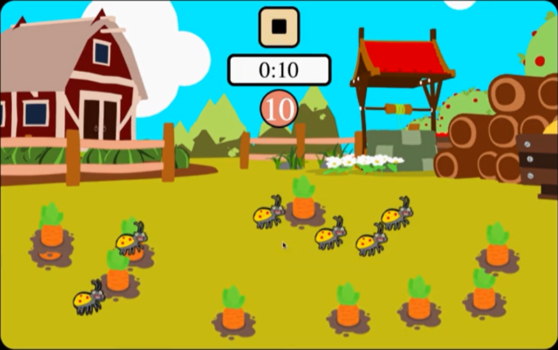
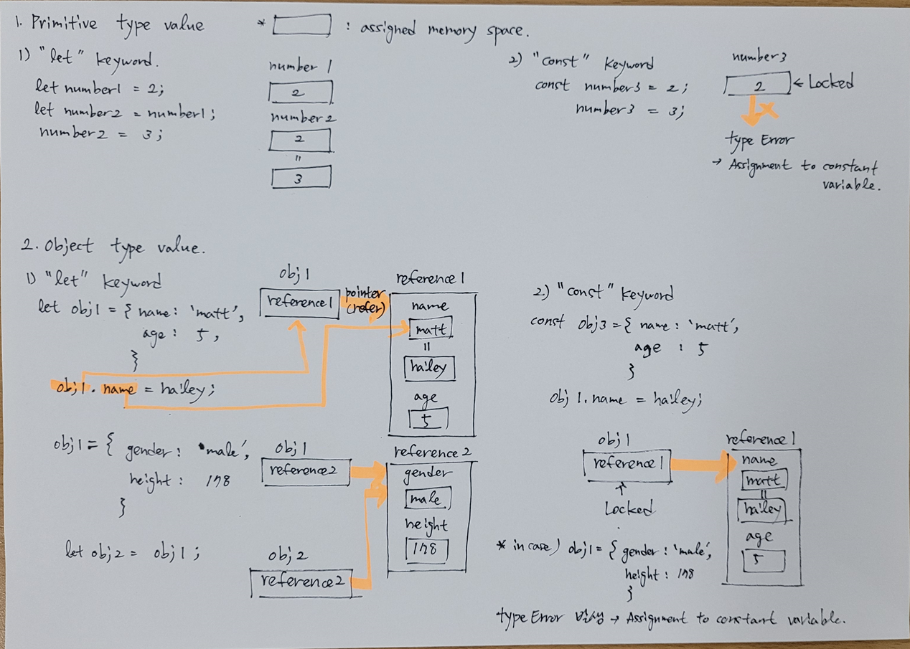
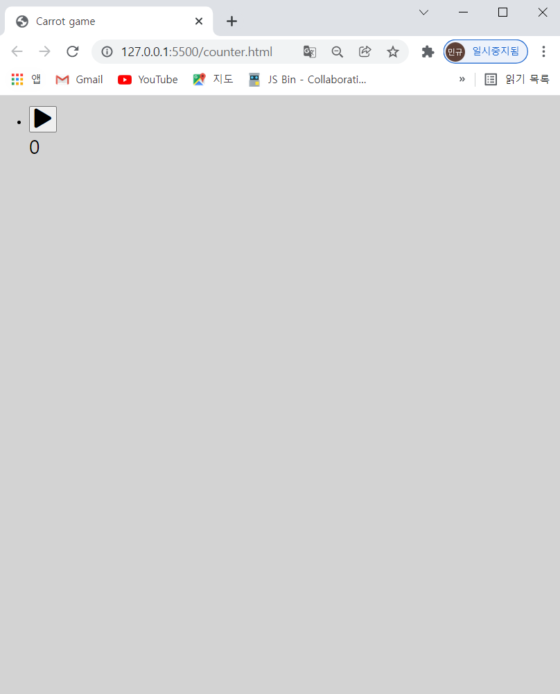
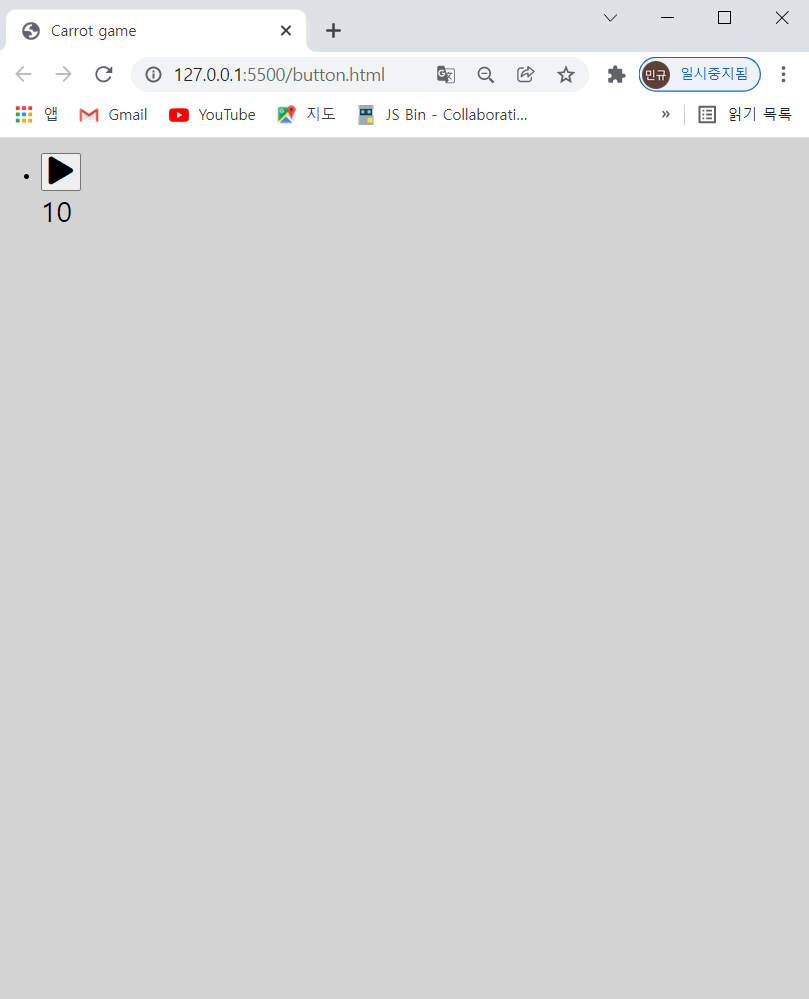
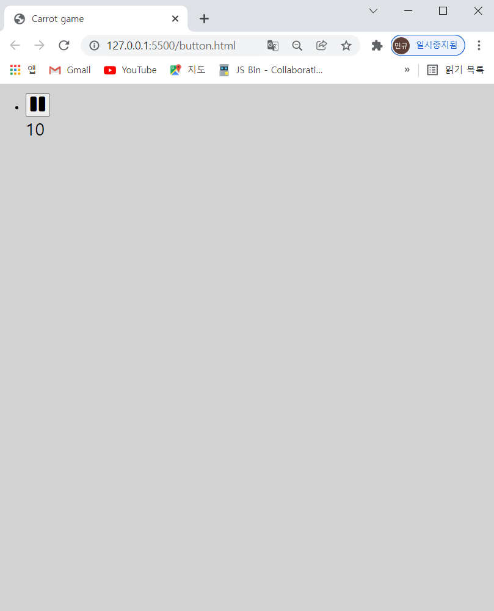
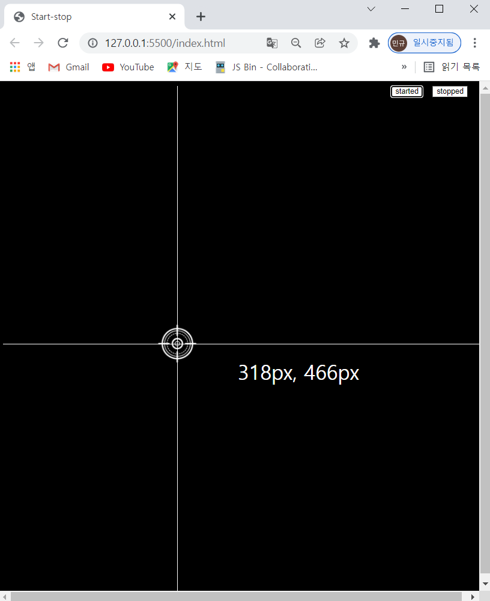
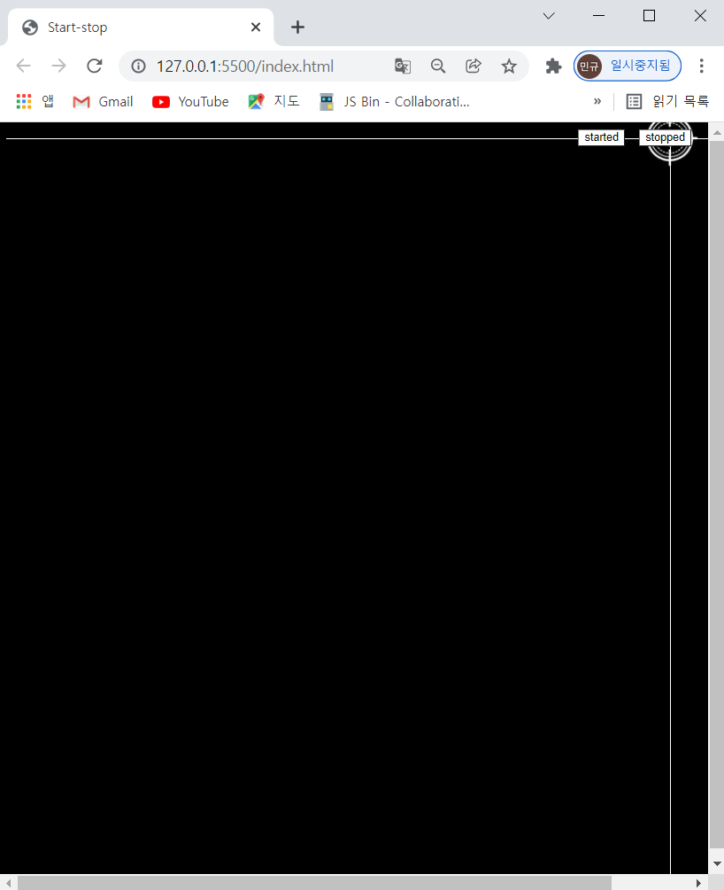
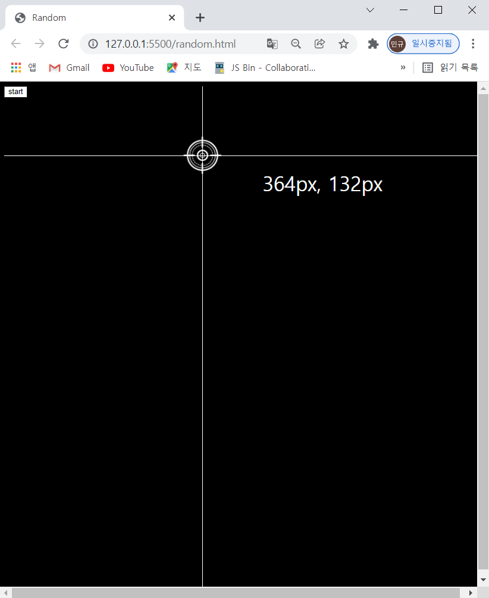

## Codes expected to be needed by me when creating carrot game

### 1. Design of keyword regarding pre-architecture

- The game should be played with timer that could discount 10s when clicking start symbol button. The start symbol button should be simultaneously changed to pause symbol button.

- Images of carrots and insects should be positioned randomly on the field whenever clicking not only start button but also pause button.

- Image of carrots should be deleted when clicking the image. In case of carrot image empty before timeout, winner pop up message should be operated with icon of replay. In contrast, in case of clicking insect image, loser pop up message should be operated with icon of replay.

- 

### 1. Timer

- `div` box could be needed to display timer and id is also assigned on tag of box to operate uniqe box regardless of other boxs on javascript. Use mutable variable with keyword named `let` because counter value should be changed per 1s. Please refer image for good understanding of values per type as below.

- 

#### 1-1. Javascript file

- In case of `setInterval()`, use with `clearInterval()` together to operate something per interval. Mutable variable should be needed and the mutable variable should be used as parameter of `clearInterval()` to operate correctly. `const timer = document.querySelector('#timer');` is same as `const timer = document.getElementById('timer);`. Javascript could generally recognize time per ms.

- `const timer = document.querySelector('#timer');`
  `let counter = 10;`
  `let timer1` = `setInterval(() => `{
  counter--;
  timer.textContent = counter;
  if (counter === 0) {
  `clearInterval(timer1);`
  `return timer1;`
  }
  }, `1000`);

- In case of all codes, Please refer file named `./brainstorming/timer/main.js`.

#### 1-2. Output

- 

### 2. Start and Pause buttons

- Start symbol button should be changed to pause symbol button when clicking the start symbol button. In addition, pause symbol button should be hidden at first because start symbol button is only appear when completed to load. In case of without pause symbol button, start symbol button and pause symbol button would be added on documentElement of broswer together.

#### 2-1. HTML file

- `<body>`
  `<ul class="items">`
  `<li class="item__row">`
  `<button class="play">`
  `<i class="fas fa-play"></i>`
  `</button>`
  `<button id="pause">`
  `<i class="fas fa-pause"></i>`
  `</button>`
  `
10
`
  `</li>`
  `</ul>`
  `</body>`

- In case of all codes, Please refer file named `./brainstorming/button/button.html`.

#### 2-2. Javascript file

- `const play = document.querySelector('.play');`
  `const pause = document.querySelector('#pause');`
  `document.querySelector('#pause').style.display = 'none';`
  `play.addEventListener`('click', () => {
  play.innerHTML = `<i class="fas fa-pause"></i>`;
  })
  `pause.addEventListener`('click', () => {
  pause.innerHTML = `<i class="fas fa-pause"></i>`;
  })

- In case of all codes, Please refer file named `./brainstorming/button/main.js`.

#### 2-3. Output

- 
  

### 3. Coordinates with buttons between named started and stopped

- Coordinates should be operated per event named `mousemove` when clicking started button. Coordinates should be also stopped when clicking stopped button.

#### 3-1. HTML file

- `.line.horizontal` is used to add and decorate line on div with CSS properties. buttons have id to connect the buttons with only a reference on javascript regardless of other references. The reason why use `removeEventListener` is that `removeEventListener` needs element that has unique id.

- `<body>`
  `

`
  `<button id="started">started</button>`
  `<button id="stopped">stopped</button>`
  `
`
  `</body>`

- In case of all codes, Please refer file named `./brainstorming/start-stop/index.html`.

#### 3-2. CSS file

- In case of tag with id, should be used with `#` such as `#started`. In case of `.line.horizontal` of HTML, `.line` and `.horizontal` are used respectively on CSS. Common properties would be written down on tag named `.line` because `line` is parent node of `horizontal`.

- `#started` {
  `background-color`: white;
  `color`: black;
  }
  `#stopped` {
  `background-color`: white;
  `color`: black;
  }
  `body` {
  `background-color`: black;
  }
  `.line` {
  `background-color: white;`
  }
  `.horizontal` {
  position: absolute;
  width: 100%;
  height: 1px;
  top: 50%;
  }

- In case of all codes, Please refer file named `./brainstorming/start-stop/style.css`.

#### 3-2. Javascript file

- Function named `operation` should be used for removeEventListener is applied to as `stopped.addEventListener('click', () => {document.removeEventListener('mousemove', operation);})`. `operation` is correct and `operation()` is not correct because syntax of `removeEventListener` recognize `operation`. The function named `operation` should use parameter as event because this function will operater when event.

- `const started = document.querySelector('#started');`
  `const stopped = document.querySelector('#stopped');`
  `const horizontal = document.querySelector('.horizontal');`
  `const vertical = document.querySelector('.vertical');`
  `const target = document.querySelector('.target');`
  `const tag = document.querySelector('.tag');`
  `started.addEventListener`('click', () => {
  `document.addEventListener`('mousemove', `operation`);
  });
  `stopped.addEventListener`('click', () => {
  `document.removeEventListener`('mousemove', `operation`);
  });
  `function operation (event)` {
  `const itemRow = document.createElement('div');`
  `itemRow.setAttribute('class', 'item__row');`
  `itemRow.innerHTML` = `template literal`
  `

`
  `

`
  ``
  `Hello`
  `<button id="started">started</button>`
  `<button id="stopped">stopped</button>`
  `template literal`;
  const X = event.clientX;
  const Y = event.clientY;
  horizontal.style.top = `${Y}px`;
  vertical.style.left = `${X}px`;
  target.style.left = `${X}px`;
  target.style.top = `${Y}px`;
  tag.style.left = `${X}px`;
  tag.style.top = `${Y}px`;
  tag.innerHTML = `${X}px, ${Y}px `;
  }

- In case of all codes, Please refer file named `./brainstorming/start-stop/main2.js`.

#### 3-3. Output

- Operating after clicking started button.

  

- Stopped when clicking stopped button

  

### 4. Coordinates with button and random function

- Coordinates should be put randomly when clicking start button.

#### 4-1. Javascript file

- To creat random values, use APIs named `Math.floor()` and `Mate.random()` after defining variable such as `let X1 = Math.floor((Math.random()*500)+1);`. In case function should be operated with event that is maybe continue to change, variables related to value should be defined within the function. In case the variables is defined outside the function, value of variable is not maybe matched between outside function and within function.

- `start.addEventListener('click', Random);`
  `function Random (event)` {
  const itemRow = document.createElement('div');
  itemRow.setAttribute('class', 'item\_\_row');
  itemRow.innerHTML= `template literal`
  `

`
  `

`
  ``
  ``
  `<button class="start">start</button>`
  `template literal`;
  `let X1 = Math.floor((Math.random()*500)+1);`
  `let Y1 = Math.floor((Math.random()*500)+1);`
  `let X = event.clientX;`
  `let Y = event.clientY;`
  `X=X1;`
  `Y=Y1;`
  horizontal.style.top = `${Y}px`;
  verticle.style.left = `${X}px`;
  target.style.top = `${Y}px`;
  target.style.left = `${X}px`;
  tag.style.top = `${Y}px`;
  tag.style.left = `${X}px`;
  tag.innerHTML = `${X}px, ${Y}px`;
  }

  - In case of all codes, Please refer file named `./brainstorming/random/main.js`.

#### 4-2. Output

- 

### 5. Resolution of failures

- symptom: `horizontal.style.top = `${Y}px`;` is operating continuously when clicking stop button. I think `removeEventListener` can not recognized function named `operation` because function do not have references of tags itself within the function when `removeEventListener` is called. So, `removeEventListener` is not be operated when clicking stopped button.

- countermeasure : references should be applied to within function. Use `node.innerHTML` or `const horizontal = document.createElement('tag type');`, `horizontal.setAttribute('class', 'horizontal');`. `node.innerHTML` would be more convenient than the other. In addition, position of buttons should be also defined to operate correctly.

- Please refer ./brainstorming/start-stop/main2.js
